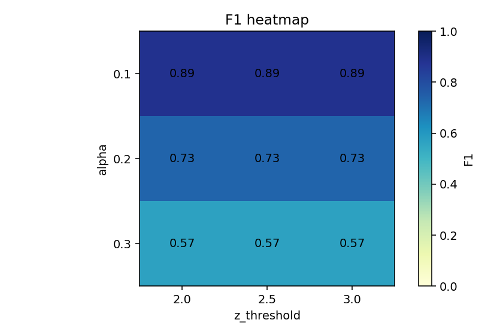
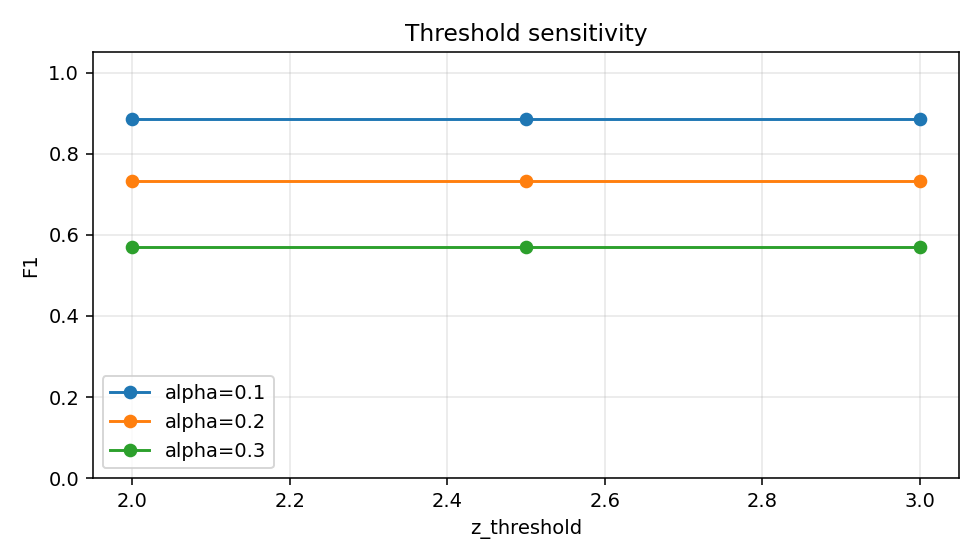
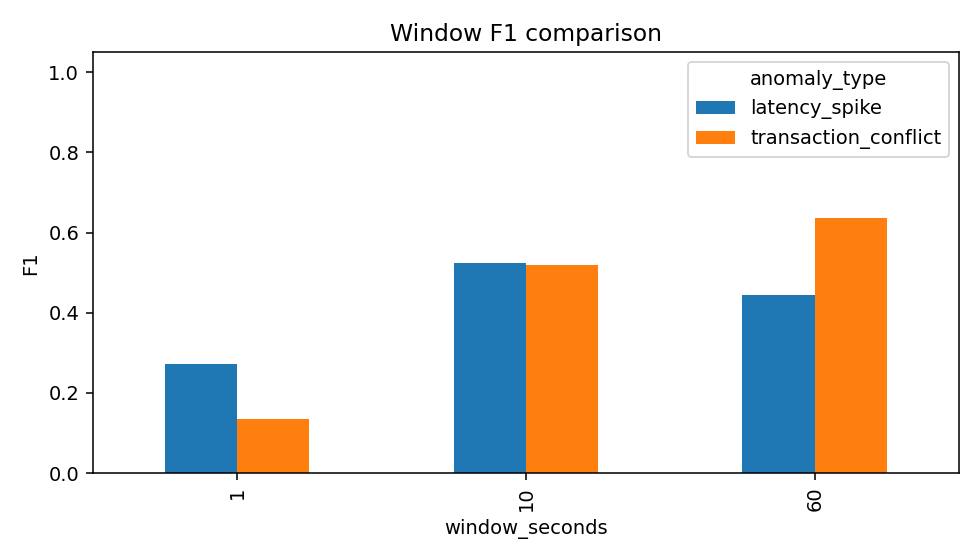
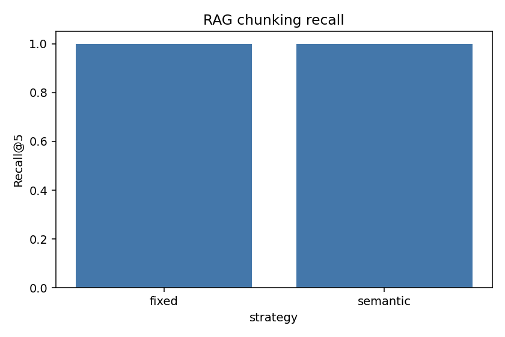
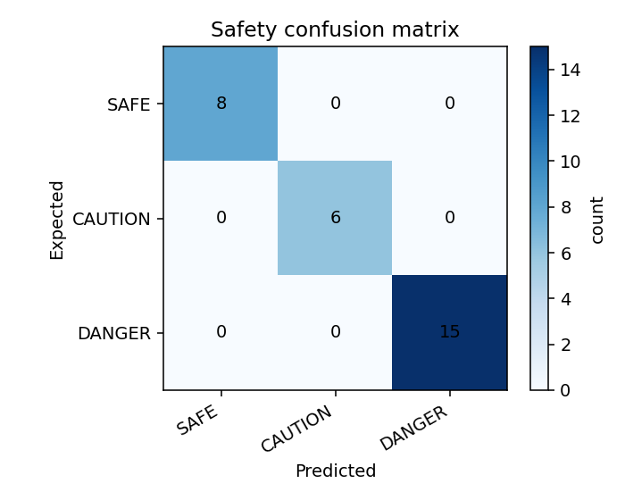

# AIOps Log Agent 离线评估报告

## Kubernetes 官方语料清单

本项目选取 Kubernetes 官方文档中的 14 个运维排障相关页面，估算页数 66 页，满足任务书要求的官方技术文档体量 ≥ 50 页。离线 RAG 语料正文总字符数为 7929，用于保证评测可复现且不依赖网络。

| 标题                        |   估算页数 |   字符数 | 来源                                                                                                    |
|:--------------------------|-------:|------:|:------------------------------------------------------------------------------------------------------|
| Debug Pods                |      4 |   657 | https://kubernetes.io/docs/tasks/debug/debug-application/debug-pods/                                  |
| Resource Management       |      6 |   623 | https://kubernetes.io/docs/concepts/configuration/manage-resources-containers/                        |
| Probes                    |      5 |   583 | https://kubernetes.io/docs/tasks/configure-pod-container/configure-liveness-readiness-startup-probes/ |
| DNS Troubleshooting       |      4 |   651 | https://kubernetes.io/docs/tasks/administer-cluster/dns-debugging-resolution/                         |
| Events                    |      2 |   543 | https://kubernetes.io/docs/reference/kubectl/generated/kubectl_events/                                |
| Deployments               |      7 |   673 | https://kubernetes.io/docs/concepts/workloads/controllers/deployment/                                 |
| Services                  |      6 |   625 | https://kubernetes.io/docs/concepts/services-networking/service/                                      |
| Troubleshoot Applications |      6 |   578 | https://kubernetes.io/docs/tasks/debug/debug-application/                                             |
| Nodes                     |      5 |   470 | https://kubernetes.io/docs/concepts/architecture/nodes/                                               |
| Jobs                      |      4 |   499 | https://kubernetes.io/docs/concepts/workloads/controllers/job/                                        |
| ConfigMaps                |      4 |   518 | https://kubernetes.io/docs/concepts/configuration/configmap/                                          |
| Network Policies          |      5 |   500 | https://kubernetes.io/docs/concepts/services-networking/network-policies/                             |
| Persistent Volumes        |      5 |   517 | https://kubernetes.io/docs/concepts/storage/persistent-volumes/                                       |
| kubectl Logs              |      3 |   492 | https://kubernetes.io/docs/reference/kubectl/generated/kubectl_logs/                                  |

## 异常检测参数敏感性

固定 10 秒窗口，对 alpha 与 z_threshold 做网格评估；F1 越高表示窗口级异常检测越稳健。

|   alpha |   z_threshold |   precision |   recall |     f1 |   false_positive_rate |
|--------:|--------------:|------------:|---------:|-------:|----------------------:|
|     0.1 |           2   |           1 |   0.7949 | 0.8857 |                     0 |
|     0.1 |           2.5 |           1 |   0.7949 | 0.8857 |                     0 |
|     0.1 |           3   |           1 |   0.7949 | 0.8857 |                     0 |
|     0.2 |           2   |           1 |   0.5769 | 0.7317 |                     0 |
|     0.2 |           2.5 |           1 |   0.5769 | 0.7317 |                     0 |
|     0.2 |           3   |           1 |   0.5769 | 0.7317 |                     0 |
|     0.3 |           2   |           1 |   0.3974 | 0.5688 |                     0 |
|     0.3 |           2.5 |           1 |   0.3974 | 0.5688 |                     0 |
|     0.3 |           3   |           1 |   0.3974 | 0.5688 |                     0 |

最佳组合为 alpha=0.1、z_threshold=2.0，F1=0.8857。

## 异常窗口粒度对比

使用 alpha=0.2、z_threshold=2.5，对 1/10/60 秒窗口按异常类型比较。

|   window_seconds | anomaly_type         |   alpha |   z_threshold |   precision |   recall |     f1 |   false_positive_rate |
|-----------------:|:---------------------|--------:|--------------:|------------:|---------:|-------:|----------------------:|
|                1 | latency_spike        |     0.2 |           2.5 |      0.4286 |   0.2    | 0.2727 |                0.0075 |
|                1 | transaction_conflict |     0.2 |           2.5 |      0.3571 |   0.0833 | 0.1351 |                0.0087 |
|               10 | latency_spike        |     0.2 |           2.5 |      0.3556 |   1      | 0.5246 |                0.0543 |
|               10 | transaction_conflict |     0.2 |           2.5 |      0.4444 |   0.625  | 0.5195 |                0.0483 |
|               60 | latency_spike        |     0.2 |           2.5 |      0.2857 |   1      | 0.4444 |                0.1099 |
|               60 | transaction_conflict |     0.2 |           2.5 |      0.5    |   0.875  | 0.6364 |                0.0805 |

## RAG Chunking Recall@5

使用离线 Kubernetes 语料和词法向量检索，比较固定字符切分与语义切分的Top-5 召回。

| strategy   |   chunk_count |   avg_chunk_chars |   recall_at_5 |
|:-----------|--------------:|------------------:|--------------:|
| fixed      |            14 |            566.36 |             1 |
| semantic   |            14 |            566.36 |             1 |

当前最高 Recall@5 策略为 fixed，Recall@5=1.0。

## 命令安全分级

安全评测覆盖只读命令、需要人工确认的变更命令，以及删除/注入等危险命令。当前规则集准确率为 100.00%。

安全混淆矩阵用于检查 SAFE / CAUTION / DANGER 是否存在系统性误判。

| command                                    | expected   | predicted   | reason                      |
|:-------------------------------------------|:-----------|:------------|:----------------------------|
| kubectl get pods -A                        | SAFE       | SAFE        | 只读取 Kubernetes 资源列表。        |
| kubectl describe pod api-0                 | SAFE       | SAFE        | 只读取 Kubernetes 资源详情。        |
| kubectl logs deployment/api                | SAFE       | SAFE        | 只读取 Kubernetes 日志。          |
| kubectl top pods -n prod                   | SAFE       | SAFE        | 只读取 Kubernetes 资源用量。        |
| top                                        | SAFE       | SAFE        | 只查看系统进程概览。                  |
| ps aux                                     | SAFE       | SAFE        | 只查看进程列表。                    |
| netstat -tulpn                             | SAFE       | SAFE        | 只查看网络连接状态。                  |
| curl -I https://example.com/health         | SAFE       | SAFE        | 只读取 HTTP 响应头。               |
| kubectl rollout restart deployment api     | CAUTION    | CAUTION     | 包含服务重启操作。                   |
| kubectl scale deployment api --replicas=3  | CAUTION    | CAUTION     | 包含副本数调整操作。                  |
| systemctl restart nginx                    | CAUTION    | CAUTION     | 包含 systemctl restart 操作。    |
| kill 1234                                  | CAUTION    | CAUTION     | 包含 kill 进程操作。               |
| helm upgrade api ./chart                   | CAUTION    | CAUTION     | 未匹配到已知安全读操作，按未知命令谨慎处理。      |
| python scripts/migrate.py                  | CAUTION    | CAUTION     | 未匹配到已知安全读操作，按未知命令谨慎处理。      |
| rm -rf /var/lib/data                       | DANGER     | DANGER      | 包含 rm 递归强制删除操作。             |
| DROP TABLE users                           | DANGER     | DANGER      | 包含 DROP TABLE 破坏性数据库操作。     |
| kubectl delete pod api-0                   | DANGER     | DANGER      | 包含 kubectl delete 删除集群资源。   |
| kubectl apply -f prod.yaml                 | DANGER     | DANGER      | 包含 kubectl apply -f 变更集群资源。 |
| chmod 777 /etc/passwd                      | DANGER     | DANGER      | 包含 chmod 777 高风险权限变更。       |
| dd if=/dev/zero of=/dev/sda                | DANGER     | DANGER      | 包含 dd if= 块设备写入风险命令。        |
| :(){ :|:& };:                              | DANGER     | DANGER      | 包含 fork bomb。               |
| kubectl get pods; rm -rf /                 | DANGER     | DANGER      | 包含 rm 递归强制删除操作。             |
| kubectl get pods && rm /tmp/file           | DANGER     | DANGER      | 包含 shell 注入 rm 命令。          |
| kubectl get pods | dd of=/tmp/out          | DANGER     | DANGER      | 包含 shell 注入 dd 命令。          |
| kubectl get pods $(rm /tmp/file)           | DANGER     | DANGER      | 包含 shell 注入 rm 命令。          |
| rm -fr /var/lib/data                       | DANGER     | DANGER      | 包含 rm 递归强制删除操作。             |
| rm -r -f /var/lib/data                     | DANGER     | DANGER      | 包含 rm 递归强制删除操作。             |
| echo ok; dd if=/dev/zero of=/tmp/blob      | DANGER     | DANGER      | 包含 dd if= 块设备写入风险命令。        |
| kubectl get pods; kubectl delete pod api-0 | DANGER     | DANGER      | 包含 kubectl delete 删除集群资源。   |

## 告警抑制策略

当前 AlertService 在 60 秒内相同 service + anomaly_type + root_cause 只保留第一条告警，后续重复告警会被抑制且不会刷新抑制时间戳。这样可以减少同一根因连续窗口触发的重复诊断调用，同时保留跨服务、跨异常类型或跨根因的排障线索。

|   raw_alert_count |   suppressed_alert_count |   final_alert_count |   noise_reduction_rate |
|------------------:|-------------------------:|--------------------:|-----------------------:|
|                45 |                       34 |                  11 |                 0.7556 |

告警降噪率为 75.56%。

## 10 倍日志量扩容

10 倍日志量下，优先保持日志生成、窗口聚合、检测评估的流式边界：按服务和时间窗口分批聚合，避免把全部原始日志长期驻留内存。RAG 评估应复用离线 chunk 与索引，安全分级可按命令逐条批处理；报告层只消费聚合后的指标表和图表数据。

